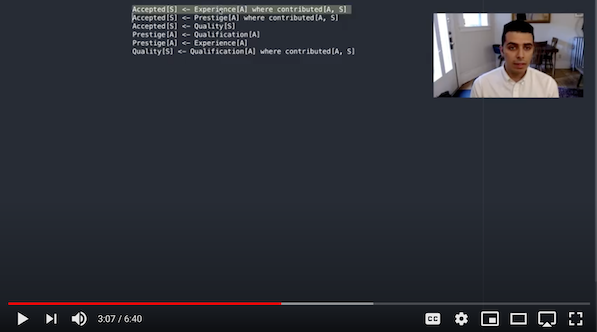

carl-lib
========

**This software is currently in beta.**

Causal Relational Learning library, implementation of the [corresponding paper](https://arxiv.org/abs/2004.03644).

Watch the video demo:

